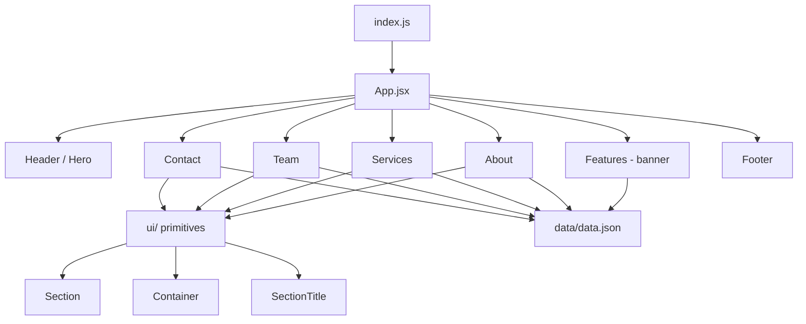

# IBA Landing Page — Refactor Plan

Tracking document for cleaning up the forked
[React-Landing-Page-Template](https://github.com/issaafalkattan/React-Landing-Page-Template)
and rebuilding the layout on a modern foundation.

> **Status legend:** `[ ]` todo · `[~]` in progress · `[x]` done

---

## Decisions

| Topic | Decision |
| --- | --- |
| **Styling** | Adopt **Tailwind CSS** (remove Bootstrap 3, jQuery, Font Awesome, nivo-lightbox) |
| **Scope** | **Cleanup + light visual refresh** — preserve current look/sections, fix layout & code |
| **Dormant sections** | **Delete** Navigation, Gallery, Testimonials, Image |
| **Deployment** | **Keep GitHub Pages + custom domain** (`ingenieurbuero-auner.com`); remove stray `_config.yml` |

### Target stack

- Create React App (`react-scripts` 5) + React 17 (unchanged)
- **Tailwind CSS v3** (see [Why v3](#risks--notes))
- `lucide-react` for icons (replaces Font Awesome)

---

## Target architecture



---

## Baseline audit (current state)

**Stack**
- CRA 5 / React 17. Styling is global CSS loaded via `<link>` in `public/index.html`:
  `bootstrap.css` (Bootstrap **3**, ~6,750 lines), `font-awesome.css` (v4), `style.css` (754 lines),
  plus nivo-lightbox. **jQuery 1.11 + bootstrap.js** loaded via `<script>` (BS3 JS depends on jQuery).
- Deployment: GitHub Actions (`tanwanimohit/deploy-react-to-ghpages`) → `gh-pages`, `CNAME` = custom domain.

**Code mess**
- Commented-out dead code in every component (`header`, `features`, `about`, `contact`, `gallery`, `testimonials`, `navigation`).
- `navigation.jsx` exists but is commented out of `App.jsx` → page has no nav.
- `features.jsx` is gutted — only a stray `` remains.
- `Gallery` / `Testimonials` exist but are disabled; `Image.jsx` only used by `Gallery`.
- `emailjs-com` installed but unused (contact form fully commented out).
- `App.css` dead; `index.css` default CRA boilerplate; `serviceWorker` unused.

**CSS problems**
- Mixed `class=` vs `className=` (`header.jsx`, `about.jsx`); typo class `text-centero` in `features.jsx`.
- Conflicting card breakpoints: `max-width:768px` (flex-column) vs `1024px` (grid 2-col) vs `600px` (grid 1-col).
- Duplicate `.hero__claim`; `#about h2::after` color equals its own background (invisible).
- Invalid CSS: `webkit-padding`/`moz-padding`; nested `@media` inside `.intro h1`.
- Hardcoded `#0a1f2e` (~8×), gradient `#6372ff`/`#5ca9fb` repeated — no design tokens.
- `!important` hacks (e.g. `flex: 0 0 50px !important`).

**Assets / structure**
- `build/` present locally (correctly gitignored). Images in `public/img/`, referenced as relative `img/...`.
- `src/pages/Impressum.jsx` unused (footer links to static `/impressum.html` + `/datenschutz.html`).

---

## Phases

### Phase 0 — Safety net
- [x] Create branch `chore/tailwind-refactor`
- [x] Baseline committed to git (`c15c6be`); visual baseline for the "light refresh" is the committed source + per-section screenshots during Phase 3
- [x] Confirm `npm run build` currently succeeds (baseline: `main.bbf23de5.js` 47.95 kB, `main.3af27a2c.css` 305 B — real CSS is unprocessed in `public/`)

### Phase 1 — Swap the styling foundation
- [x] Install dev deps: `npm i -D tailwindcss@3 postcss autoprefixer` (→ tailwindcss 3.4.19, postcss 8.5.29, autoprefixer 10.6.1)
- [x] Install runtime dep: `npm i lucide-react` (→ 1.54.0)
- [x] Create `tailwind.config.js` with `content: ["./src/**/*.{js,jsx}", "./public/index.html"]`
- [x] ~~Generate `postcss.config.js`~~ → **not needed / ignored by CRA** (see [Discovery](#discovery-cra-5--tailwind))
- [x] Add design tokens to `theme.extend` in `tailwind.config.js`:
      `colors.brand = #0a1f2e` (+`brand.alt`), `colors.accent.{from,to} = #6372ff / #5ca9fb`,
      `colors.link`, `colors.surface`, `fontFamily.heading/body/nav`, `maxWidth.container`
- [x] Add `@tailwind base / components / utilities` to `src/index.css` (+ base layer: smooth scroll, body font/color, heading font)
- [x] Clean `public/index.html`: remove Bootstrap/Font Awesome/style.css/nivo-lightbox `<link>`s and jQuery/bootstrap `<script>`s (kept favicon, apple-touch; added font `preconnect`)
- [x] Delete `public/css/`, `public/js/`, `public/fonts/` (Font Awesome + glyphicons)
- [x] Remove duplicate `yarn.lock` (deploy action runs `npm ci`, so npm is the single package manager)
- [ ] Map `fa fa-*` icon strings in `data.json` → `lucide-react` components → *moved to Phase 3*

**Checkpoint:** app renders (roughly unstyled) and builds with Tailwind active; legacy CSS gone.
→ ✅ Verified: build compiled, processed CSS grew `305 B → 1.72 kB` (Tailwind preflight now active).

### Phase 2 — Remove dead code & unused files
- [ ] Delete components: `navigation.jsx`, `gallery.jsx`, `testimonials.jsx`, `image.jsx`
- [ ] Strip commented-out blocks from `header.jsx`, `features.jsx`, `about.jsx`, `contact.jsx`, `services.jsx`, `Team.jsx`
- [ ] Delete dead files: `src/App.css`, `src/serviceWorker.js` (+ its import in `index.js`), `src/pages/Impressum.jsx`, root `_config.yml`, local `build/`
- [ ] Remove deps: `emailjs-com`, `smooth-scroll`
- [ ] `data.json`: remove `Gallery`, `Testimonials`, `Features`, `About.Why`/`Why2`, unused `Contact` social fields
- [ ] Extract footer from `contact.jsx` into `src/components/Footer.jsx`

**Checkpoint:** no dead files remain; `npm run build` still green.

### Phase 3 — Rebuild layout with Tailwind + shared primitives
- [ ] Create `src/components/ui/Section.jsx` (vertical rhythm `py-20 md:py-28`, dark/light variant, `id` + `scroll-mt-24`)
- [ ] Create `src/components/ui/Container.jsx` (max-width + padding)
- [ ] Create `src/components/ui/SectionTitle.jsx` (eyebrow/heading/underline pattern)

| Component | Change |
| --- | --- |
| `header.jsx` | Convert hero to Tailwind; `class=`→`className=`; keep logo + claim; remove invalid nested CSS |
| `features.jsx` | Turn gutted component into a clean full-width **banner** (`fraese.png`) with alt + responsive image |
| `about.jsx` | 4 `.card`s → `grid sm:grid-cols-2 lg:grid-cols-4`; kill conflicting breakpoints; `class=`→`className=` |
| `services.jsx` | Replace BS `col-md-4` + `fa` icons → `grid md:grid-cols-3` + lucide icons |
| `Team.jsx` | Replace BS grid + `thumbnail` → Tailwind cards; responsive images |
| `contact.jsx` | Two-column layout; keep tel/mailto; delete commented form + social |
| `Footer.jsx` | Datenschutz / Impressum links + copyright |

- [ ] Apply rules throughout: `class=`→`className=`, drop `text-centero`, no `id`-based CSS, no inline `style={{}}`, consistent `sm/md/lg` breakpoints

### Phase 4 — Tokens, typography, consistency
- [ ] All colors/fonts sourced from `tailwind.config.js` (no repeated hex literals)
- [ ] Uniform heading scale; body via `font-body`
- [ ] Consistent section spacing + alternating dark/light backgrounds (currently `#0a1f2e` everywhere)

### Phase 5 — Accessibility & polish
- [ ] `alt` on all images; `aria-label` on icon-only links
- [ ] Semantic landmarks (`<header>`, `<main>`, `<section>`, `<footer>`); exactly one `<h1>` (hero)
- [ ] Smooth anchor scroll via `scroll-smooth` + `scroll-mt-24` (remove `smooth-scroll` lib)
- [ ] Visible focus states
- [ ] `loading="lazy"` + explicit dimensions on below-the-fold images

### Phase 6 — Content cleanup
- [ ] Remove Lorem ipsum, placeholder address (`4321 California St…`), dead English nav labels
- [ ] Keep German copy consistent across About / Services / Team / Contact

### Phase 7 — Validate & deploy
- [ ] `npm run build` and manual QA at 375 / 768 / 1440 px
- [ ] Lighthouse pass (performance + accessibility)
- [ ] Keep `CNAME` (+ `public/CNAME`) and the `deploy.yml` workflow
- [ ] Set `"homepage": "https://ingenieurbuero-auner.com"` in `package.json`
- [ ] _(Optional)_ Replace third-party action with `actions/setup-node` + `peaceiris/actions-gh-pages`
- [ ] Keep `public/datenschutz.html`, `public/impressum.html`, `public/robots.txt`

**Checkpoint:** a11y + Lighthouse + deploy dry run.

---

## Execution order & checkpoints

1. **Phase 0–1** → app renders with Tailwind active, legacy CSS gone
2. **Phase 2** → no dead files, build still green
3. **Phase 3–4** → visual QA per section (bulk of the work)
4. **Phase 5–7** → a11y + Lighthouse + deploy dry run

---

## Discovery: CRA 5 + Tailwind

`react-scripts` 5 **auto-enables Tailwind** when `tailwind.config.js` exists at the project root:

```js
// node_modules/react-scripts/config/webpack.config.js
const useTailwind = fs.existsSync(path.join(paths.appPath, 'tailwind.config.js'));
...
plugins: !useTailwind ? [ /* flexbugs-fixes, preset-env, normalize */ ]
                      : ['tailwindcss', /* flexbugs-fixes, preset-env */]
```

Consequences:
- **No `postcss.config.js` is required** — CRA sets `config: false`, so an external PostCSS config is **ignored**. Just `tailwind.config.js` + `@tailwind` directives is enough.
- Tailwind's PostCSS plugin reads `tailwind.config.js` from the project root, so the `content` globs must cover every file containing class names.

## Risks & notes

- **Tailwind v4 vs CRA 5:** pinned **Tailwind v3** (3.4.19). v4's PostCSS plugin is not compatible with CRA 5's PostCSS 8 pipeline.
- **Bootstrap removal is a visible change:** mitigate by doing it section-by-section with visual comparison against the Phase 0 baseline (per-section screenshots during Phase 3).
- **Deploy uses npm:** the `tanwanimohit/deploy-react-to-ghpages` action runs `npm i` → `npm ci` → `npx react-scripts build`, so `package-lock.json` must stay in sync with `package.json`. `yarn.lock` was removed to avoid drift.

---

## Progress log

| Date | Phase | Notes |
| --- | --- | --- |
| 2026-10-09 | Planning | Baseline audit complete; plan created |
| 2026-10-09 | 0 | Branch `chore/tailwind-refactor`; baseline committed `c15c6be`; baseline build green |
| 2026-10-09 | 1 | Tailwind 3.4.19 wired via `tailwind.config.js` (CRA auto-detect); legacy CSS/JS/fonts deleted; duplicate `yarn.lock` removed; build green (CSS 305 B → 1.72 kB) |
